# Image Matching Report (ORB_BF and SIFT_FLANN)

**Threshold Used**: 20

## Comparing efficiency

### Time

For all images ORB_BF is markedly faster.

### Accuracy

SIFT_FLANN seems to find more good matches, but more of its matches are incorrect. It is hard to decide what is better for most uses, but for this i would say less false positive/negatives is better. Meaning ORB_BF is better.

### Resources

ORB_BF seems much more memory efficient, when there are few matches, but usese more and more memory as the amount of matches grows.

## ORB_BF Approach

- **Data_Check Accuracy**: 80.00% (16/20)
- **Data_Check Avg Time**: 0.0159s (±0.0277s)
- **Data_Check Avg Memory**: 4380.20KB

### Confusion Matrix (Data_Check)
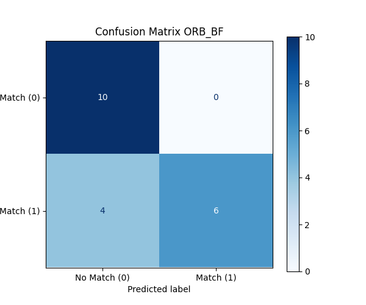

### Match Counts Plot (Data_Check)
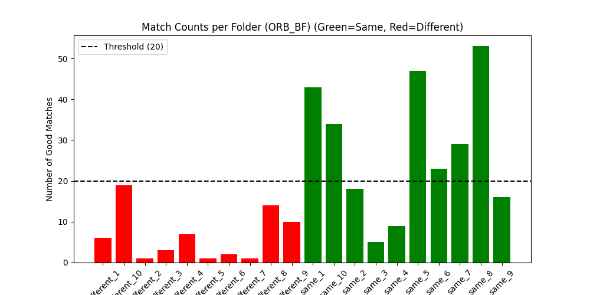

ORB_BF often has quite few good matches on most different fingerprints, and a lot on most of the same fingerprints. But there there are a few in each category where it is much less sure.

### Per-Pair Results (Data_Check)
| Folder | Expected | Predicted | Good Matches | Visualization |
|--------|----------|-----------|--------------|---------------|
| different_1 | No Match | No Match | 6 | 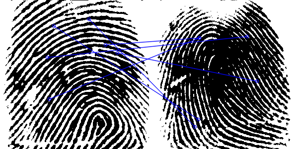 |
| different_10 | No Match | No Match | 19 | 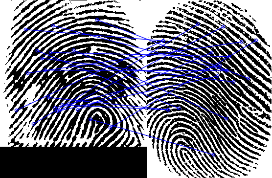 |
| different_2 | No Match | No Match | 1 | 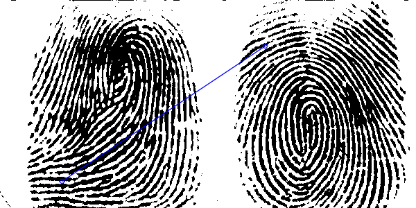 |
| different_3 | No Match | No Match | 3 | 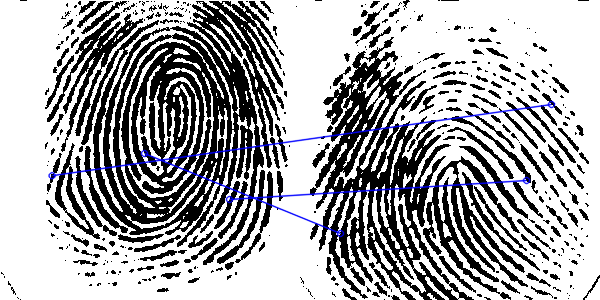 |
| different_4 | No Match | No Match | 7 | 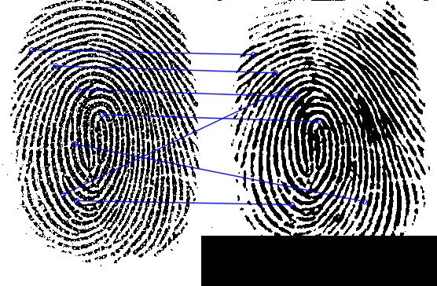 |
| different_5 | No Match | No Match | 1 | 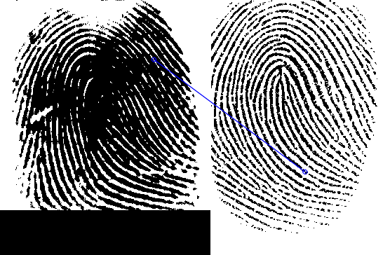 |
| different_6 | No Match | No Match | 2 | 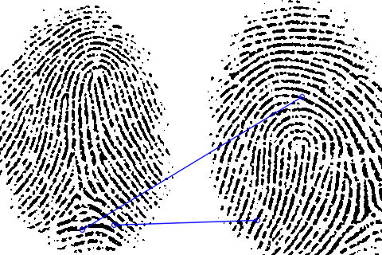 |
| different_7 | No Match | No Match | 1 | 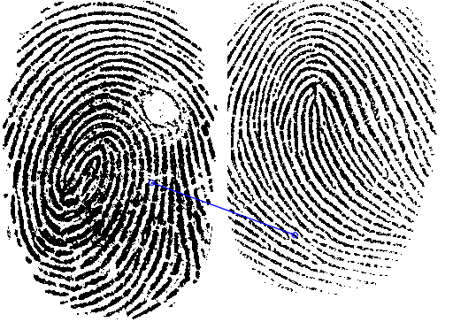 |
| different_8 | No Match | No Match | 14 | 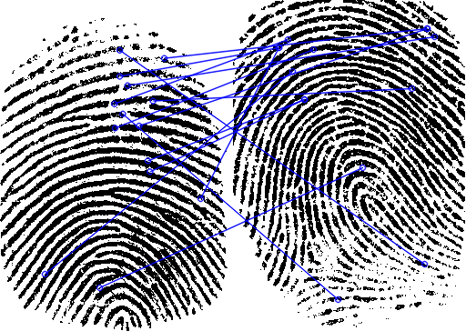 |
| different_9 | No Match | No Match | 10 | 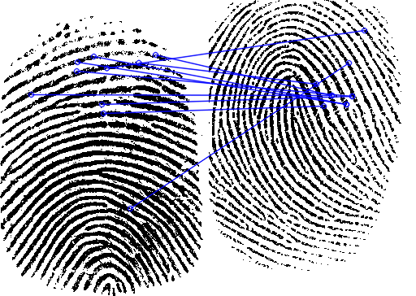 |
| same_1 | Match | Match | 43 | 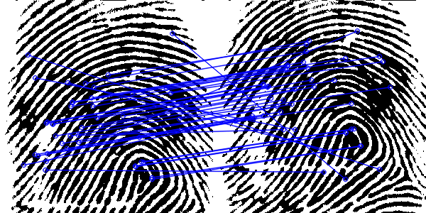 |
| same_10 | Match | Match | 34 | 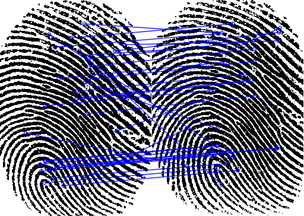 |
| same_2 | Match | No Match | 18 | 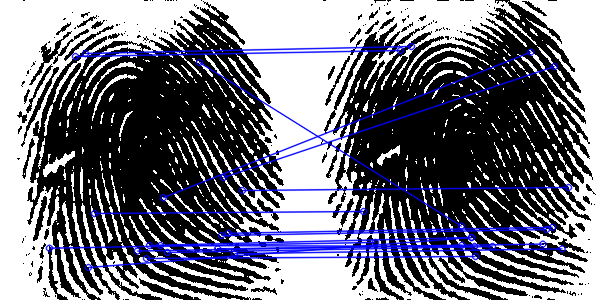 |
| same_3 | Match | No Match | 5 | 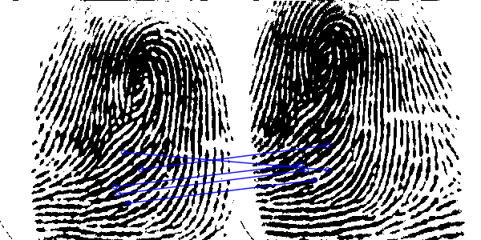 |
| same_4 | Match | No Match | 9 | 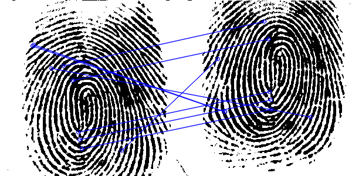 |
| same_5 | Match | Match | 47 | 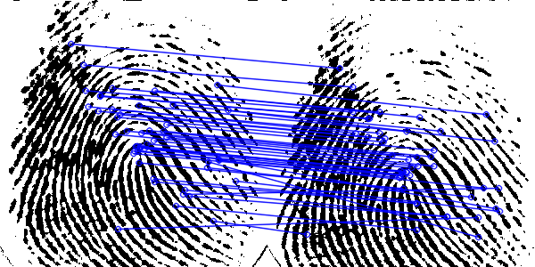 |
| same_6 | Match | Match | 23 | 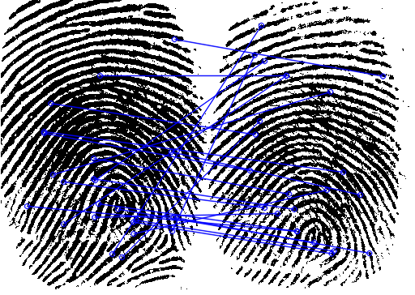 |
| same_7 | Match | Match | 29 | 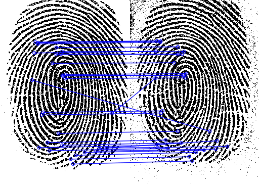 |
| same_8 | Match | Match | 53 | 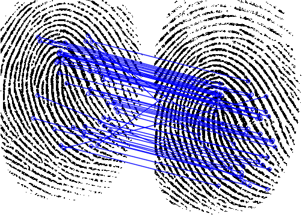 |
| same_9 | Match | No Match | 16 | 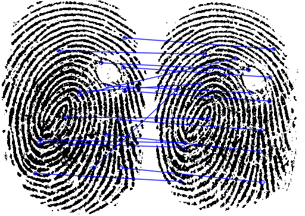 |

Looking at the results per match, we see that the fingerprints that are clearly different or clearly the same, have this reflected in good matches, but the more difficult to compare images are unsure, this makes sense. Changing the threshold either way would create more false positives or false negatives.

## SIFT_FLANN Approach

- **Data_Check Accuracy**: 85.00% (17/20)
- **Data_Check Avg Time**: 0.0601s (±0.0025s)
- **Data_Check Avg Memory**: 3032.60KB

### Confusion Matrix (Data_Check)
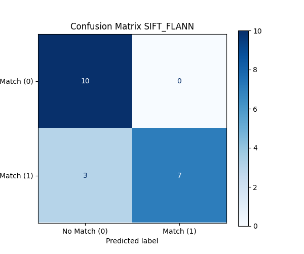

### Match Counts Plot (Data_Check)
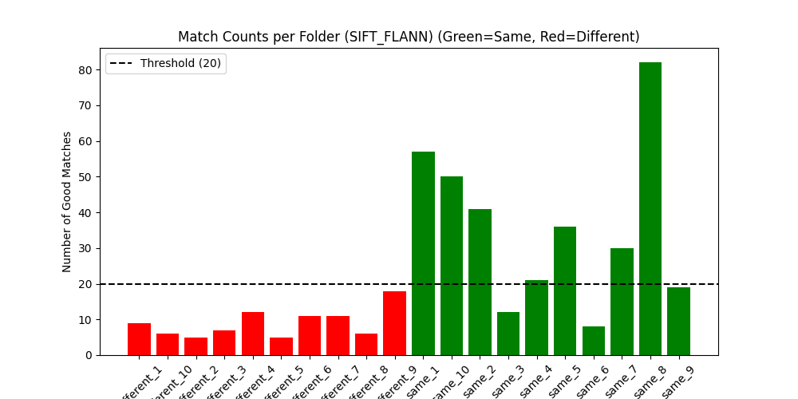

SIFT_FLANN seems to generally find more matches. But not as many relatively on same matches as on different matches. This hints to it finding more incorrect good matches.

### Per-Pair Results (Data_Check)
| Folder | Expected | Predicted | Good Matches | Visualization |
|--------|----------|-----------|--------------|---------------|
| different_1 | No Match | No Match | 9 | 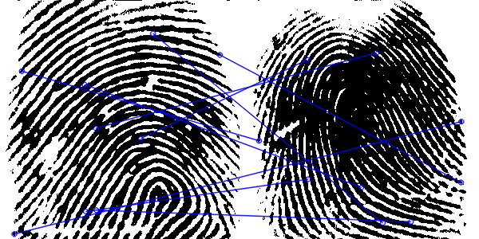 |
| different_10 | No Match | No Match | 6 | 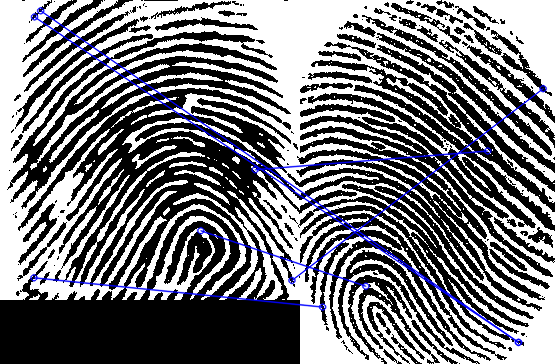 |
| different_2 | No Match | No Match | 5 | 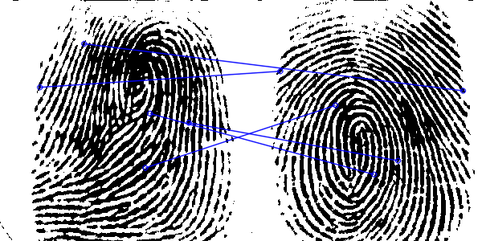 |
| different_3 | No Match | No Match | 7 | 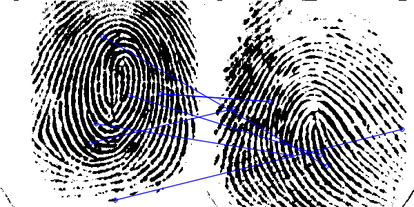 |
| different_4 | No Match | No Match | 12 | 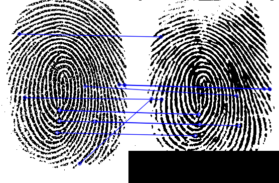 |
| different_5 | No Match | No Match | 5 | 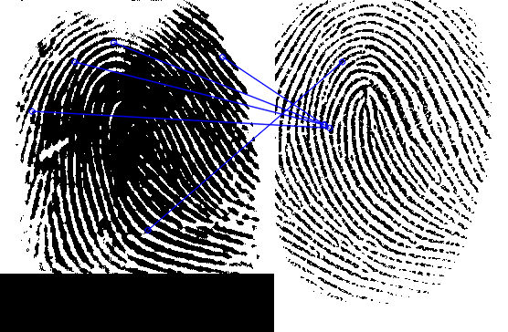 |
| different_6 | No Match | No Match | 11 | 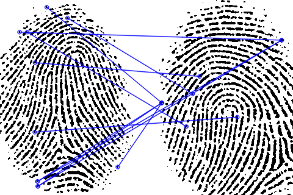 |
| different_7 | No Match | No Match | 11 | 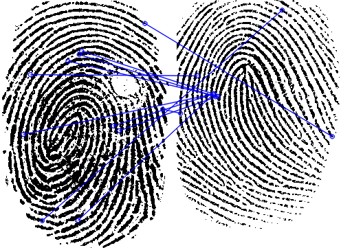 |
| different_8 | No Match | No Match | 6 | 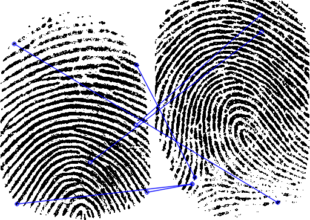 |
| different_9 | No Match | No Match | 18 | 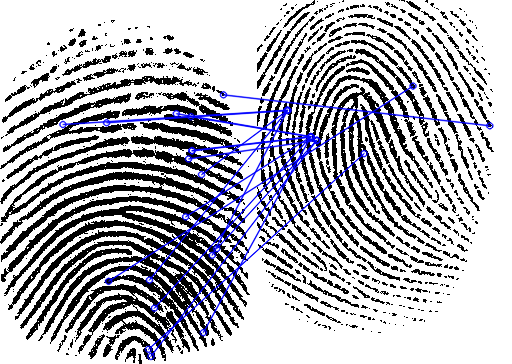 |
| same_1 | Match | Match | 57 | 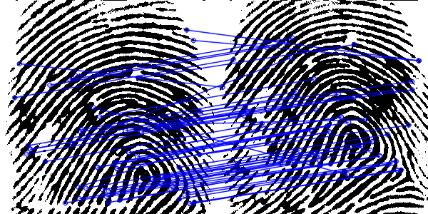 |
| same_10 | Match | Match | 50 | 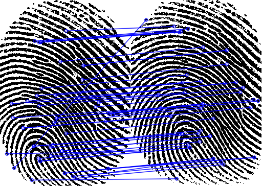 |
| same_2 | Match | Match | 41 | 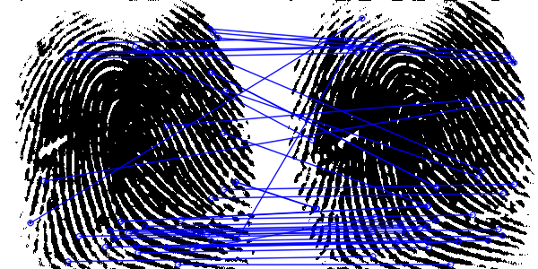 |
| same_3 | Match | No Match | 12 | 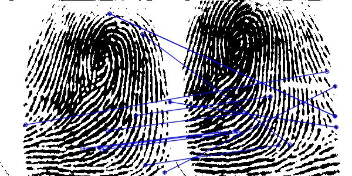 |
| same_4 | Match | Match | 21 | 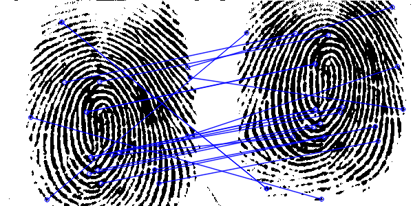 |
| same_5 | Match | Match | 36 | 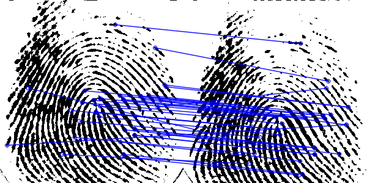 |
| same_6 | Match | No Match | 8 | 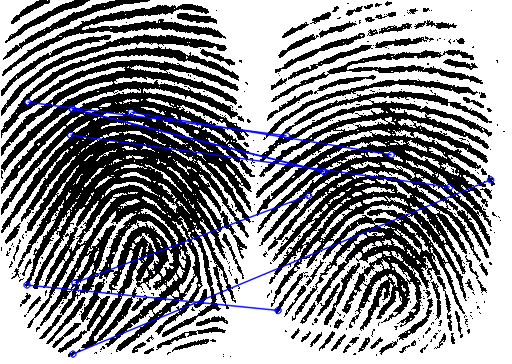 |
| same_7 | Match | Match | 30 | 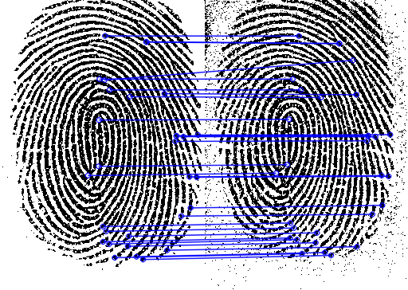 |
| same_8 | Match | Match | 82 | 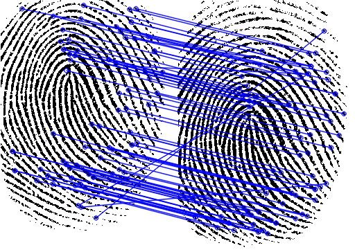 |
| same_9 | Match | No Match | 19 | 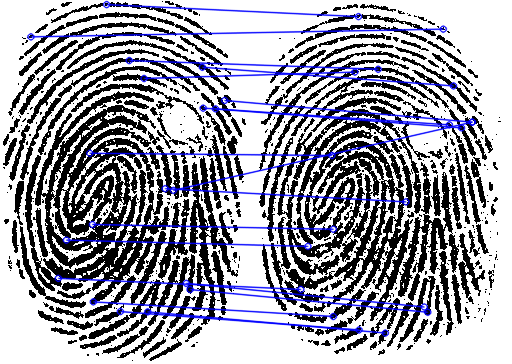 |

Looking at the results per match, we see that it does indeed find more incorrect good matches.

## UIA Matching

### ORB_BF Approach

- **Predicted**: No Match
- **Good Matches**: 1
- **Time**: 0.0235s
- **Memory**: 468.00KB

ORB_BF finds next to no matches, and the found match is incorrect. This makes sense seeing as the images are so different, in perspective, location, brightness, season etc.

## SIFT_FLANN Approach

- **Predicted**: No Match
- **Good Matches**: 13
- **Time**: 0.2481s
- **Memory**: 4228.00KB

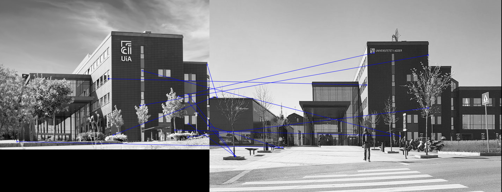

SIFT_FLANN finds more good matches, but none of them are correct still. This fits the previous trend of false positives with SIFT_FLANN.

