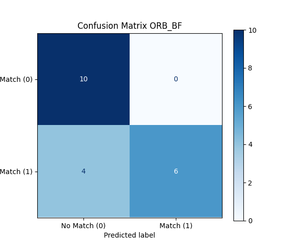
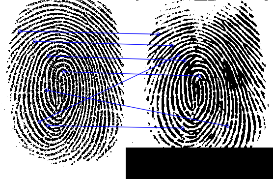
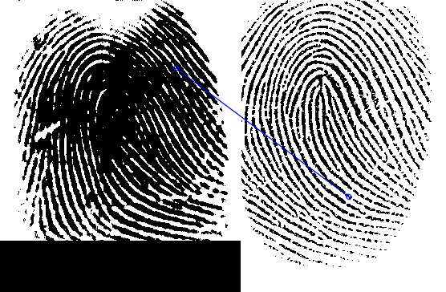
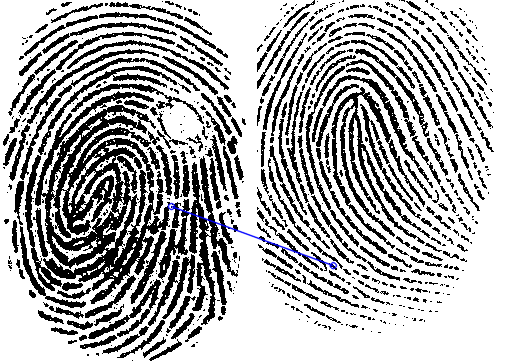
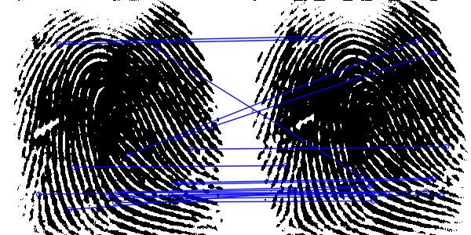
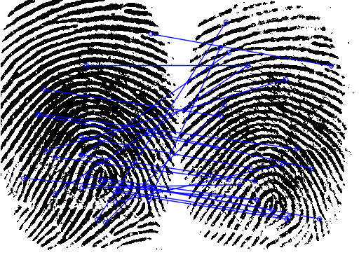
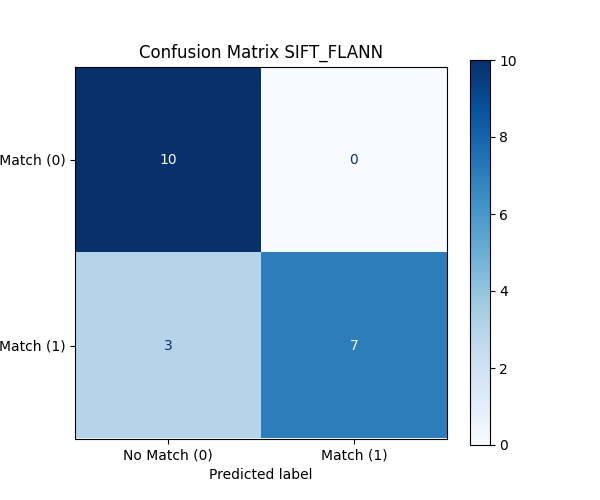
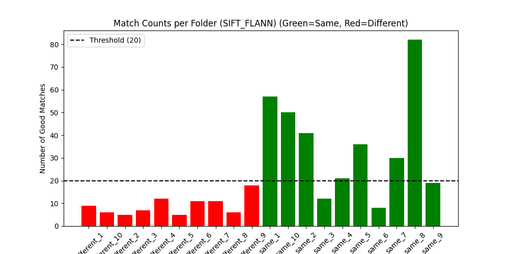
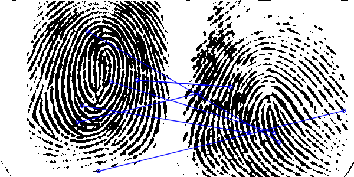

# Image Matching Report (ORB_BF and SIFT_FLANN)

**Threshold Used**: 20

## ORB_BF Approach

- **Data_Check Accuracy**: 80.00% (16/20)
- **Data_Check Avg Time**: 0.0171s (±0.0324s)

### Confusion Matrix (Data_Check)

### Match Counts Plot (Data_Check)

### Per-Pair Results (Data_Check)
| Folder | Expected | Predicted | Good Matches | Visualization |
|--------|----------|-----------|--------------|---------------|
| different_1 | No Match | No Match | 6 |  |
| different_10 | No Match | No Match | 19 |  |
| different_2 | No Match | No Match | 1 |  |
| different_3 | No Match | No Match | 3 |  |
| different_4 | No Match | No Match | 7 |  |
| different_5 | No Match | No Match | 1 |  |
| different_6 | No Match | No Match | 2 |  |
| different_7 | No Match | No Match | 1 |  |
| different_8 | No Match | No Match | 14 |  |
| different_9 | No Match | No Match | 10 |  |
| same_1 | Match | Match | 43 |  |
| same_10 | Match | Match | 34 |  |
| same_2 | Match | No Match | 18 |  |
| same_3 | Match | No Match | 5 |  |
| same_4 | Match | No Match | 9 |  |
| same_5 | Match | Match | 47 |  |
| same_6 | Match | Match | 23 |  |
| same_7 | Match | Match | 29 |  |
| same_8 | Match | Match | 53 |  |
| same_9 | Match | No Match | 16 |  |

### UiA Images Results
- **Predicted**: No Match
- **Good Matches**: 1
- **Time**: 0.0239s

## SIFT_FLANN Approach

- **Data_Check Accuracy**: 85.00% (17/20)
- **Data_Check Avg Time**: 0.0621s (±0.0034s)

### Confusion Matrix (Data_Check)

### Match Counts Plot (Data_Check)

### Per-Pair Results (Data_Check)
| Folder | Expected | Predicted | Good Matches | Visualization |
|--------|----------|-----------|--------------|---------------|
| different_1 | No Match | No Match | 9 |  |
| different_10 | No Match | No Match | 6 |  |
| different_2 | No Match | No Match | 5 |  |
| different_3 | No Match | No Match | 7 |  |
| different_4 | No Match | No Match | 12 |  |
| different_5 | No Match | No Match | 5 |  |
| different_6 | No Match | No Match | 11 |  |
| different_7 | No Match | No Match | 11 |  |
| different_8 | No Match | No Match | 6 |  |
| different_9 | No Match | No Match | 18 |  |
| same_1 | Match | Match | 57 |  |
| same_10 | Match | Match | 50 |  |
| same_2 | Match | Match | 41 |  |
| same_3 | Match | No Match | 12 |  |
| same_4 | Match | Match | 21 |  |
| same_5 | Match | Match | 36 |  |
| same_6 | Match | No Match | 8 |  |
| same_7 | Match | Match | 30 |  |
| same_8 | Match | Match | 82 |  |
| same_9 | Match | No Match | 19 |  |

### UiA Images Results
- **Predicted**: No Match
- **Good Matches**: 13
- **Time**: 0.2536s

